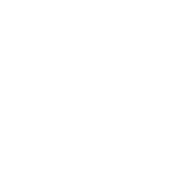

<h1 align="center">Cryptoverse</h1>

<div align="center">

</div>

<br />

<div align="center">

[](https://cryptojsx.netlify.app/)
[]()
[](https://cryptojsx.netlify.app/)

</div>

<br />

<p align="center"> A fully functional Cryptocurrency application using React.js, Redux Toolkit and Chart.js.
</p>

## [Live link](https://cryptojsx.netlify.app/ "Live link")

## 📷 ScreenShots <a name = "ScreenShots"></a>

<br>


## ⛓️ Dependencies <a name = "dependencies"></a>

<br>

- "@ant-design/icons": "^4.7.0",
- "@reduxjs/toolkit": "^1.6.2",
- "@testing-library/jest-dom": "^5.14.1",
- "@testing-library/react": "^11.2.7",
- "@testing-library/user-event": "^12.8.3",
- "antd": "^4.16.13",
- "axios": "^0.23.0",
- "chart.js": "^3.5.1",
- "html-react-parser": "^1.4.0",
- "millify": "^4.0.0",
- "moment": "^2.29.1",
- "react": "^17.0.2",
- "react-chartjs-2": "^3.1.1",
- "react-dom": "^17.0.2",
- "react-redux": "^7.2.5",
- "react-router-dom": "^5.3.0",
- "react-scripts": "4.0.3",
- "web-vitals": "^1.1.2"

## 🏁 Getting Started <a name = "getting_started"></a>

These instructions will get you a copy of the project up and running on your local machine for development
and testing purposes. See [deployment](#deployment) for notes on how to deploy the project on a live system.

### Installing

```
npm install
```

## 🎈 Usage <a name="usage"></a>

```
npm start
```

## ⛏️ Built With <a name = "tech_stack"></a>

- [React.js](https://reactjs.org/) - Front-end JavaScript library
- [Redux Toolkit](https://redux-toolkit.js.org/) - State Management
- [Ant Design](https://ant.design/) - UI Creation
- [Chart.js](https://www.chartjs.org/) - Charts Creation

## ✍️ Authors <a name = "authors"></a>

- [Youssef Sahli](https://github.com/Myduzo)
